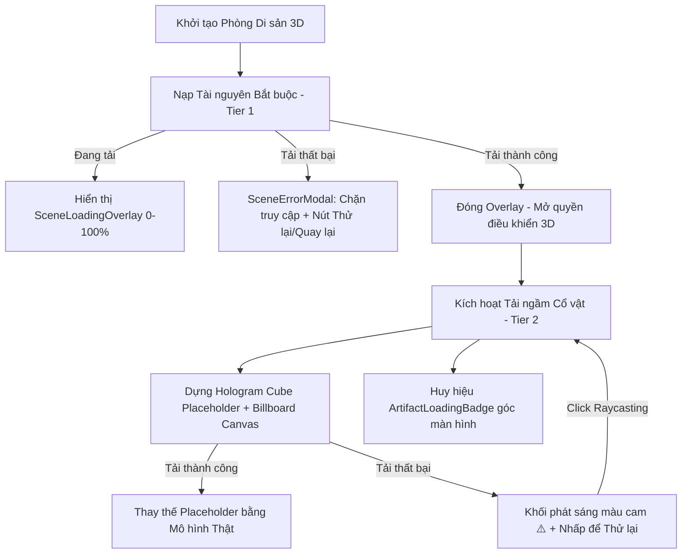
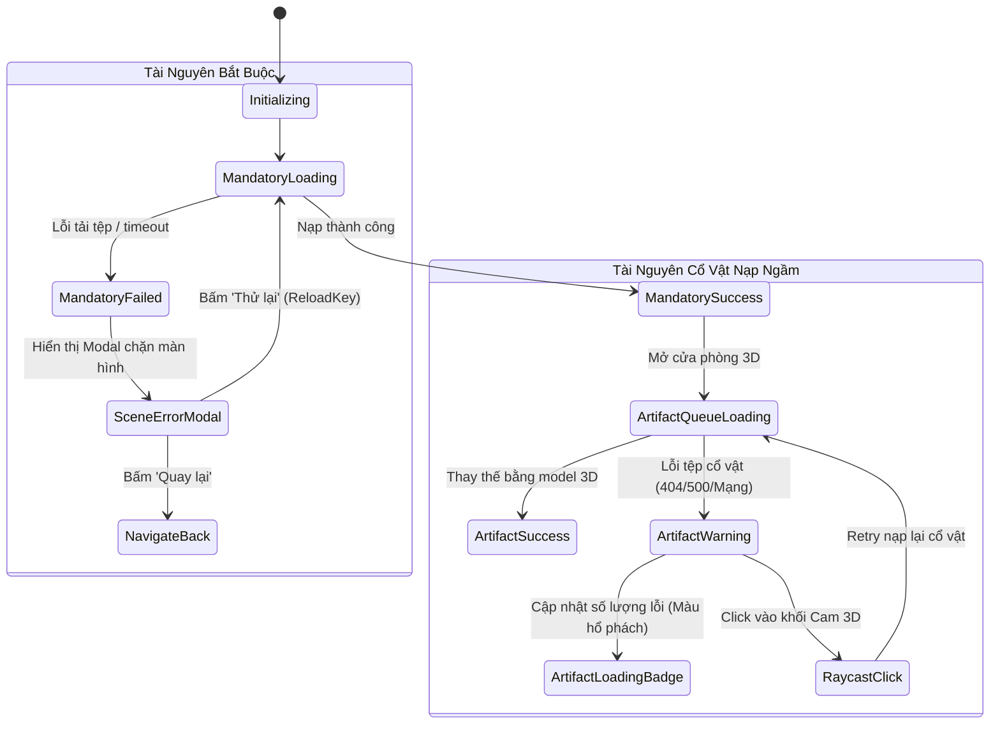

# Tài Liệu Đặc Tả Kỹ Thuật (Preview Document)
## Hệ Thống Phân Tầng Nạp Tài Nguyên & Xử Lý Lỗi Phòng Trưng Bày 3D

- **Dự án**: Trưng Bày & Khám Phá Cổ Vật 3D (`co-vat-3d`)
- **Phạm vi áp dụng**: Mô-đun không gian di sản số 3D ([HeritageTourDetail](file:///f:/SavaProjects/co-vat-3d/src/pages/HeritageTourDetail/index.tsx))
- **Trạng thái**: Hoàn thiện thiết kế & Sẵn sàng nghiệm thu

---

## 1. Tổng Quan Kiến Trúc (Architecture Overview)

Mô hình phòng trưng bày 3D chứa dung lượng tài nguyên lớn gồm: không gian kiến trúc di sản, mô hình nhân vật người dùng, hoạt ảnh di chuyển và danh sách nhiều hiện vật cổ vật độ chi tiết cao. 

Kiến trúc xử lý tài nguyên được phân chia thành **2 tầng độc lập (Two-Tier Architecture)**:
1. **Tầng 1 (Bắt buộc - Critical/Mandatory)**: Đảm bảo nền móng không gian và nhân vật phải sẵn sàng trước khi cho phép người dùng bước vào.
2. **Tầng 2 (Tải ngầm - Non-Critical/Deferred Background)**: Nạp bất đồng bộ danh sách hiện vật trong lúc người dùng đã di chuyển tự do trong không gian, đi kèm placeholder 3D và cơ chế khôi phục lỗi độc lập.

---

## 2. Chi Tiết Task 1: Phân Tầng Nạp Tài Nguyên & Hiển Thị Tiến Trình

### 2.1. Mô Tả Yêu Cầu (Description)
- Khi truy cập vào một phòng cổ vật, cần hiển thị loading progress để người dùng xem được trạng thái tiến trình.
- Cần tách việc loading làm 2 loại:
  1. **Loại bắt buộc**: Môi trường phòng trưng bày (Environment), tài nguyên nhân vật cốt lõi.
  2. **Loại tải ngầm trong quá trình trải nghiệm**: Danh sách các cổ vật/hiện vật trong phòng.

### 2.2. Phân Loại Tài Nguyên & Quy Trình Nạp

| Tiêu chí | Tầng 1: Bắt buộc (Mandatory) | Tầng 2: Tải ngầm (Deferred Background) |
| :--- | :--- | :--- |
| **Danh mục tài nguyên** | - Kiến trúc phòng trưng bày (`environment.modelUrl`) - Model nhân vật 3D (`PlayerLoader`) - Hoạt ảnh (`IdleAnimation`, `WalkAnimation`) - Hệ thống va chạm (`ColliderManager`, Physics) | - Toàn bộ mô hình cổ vật trong phòng (`destination.artifacts`) |
| **Cơ chế tải** | `THREE.LoadingManager` + `Promise.all` song song | Concurrency Queue Pool (tối đa 3 vật phẩm tải đồng thời) |
| **Trải nghiệm người dùng** | Chặn toàn màn hình qua màn hình chờ | Cho phép người chơi di chuyển, quan sát bình thường |
| **Giao diện hiển thị** | `SceneLoadingOverlay` (Thanh tiến trình toàn màn hình) | `ArtifactLoadingPlaceholder` (Khối Hologram 3D) & `ArtifactLoadingBadge` (Góc màn hình) |

### 2.3. Thiết Kế Giao Diện & Kỹ Thuật Tiến Trình

1. **Màn hình chờ toàn cảnh ([SceneLoadingOverlay.tsx](file:///f:/SavaProjects/co-vat-3d/src/pages/HeritageTourDetail/components/SceneLoadingOverlay.tsx))**:
   - Che phủ toàn màn hình (`z-index: 9999`) với hiệu ứng blur nền tối.
   - Hiển thị thanh tiến trình mượt mà từ 0% đến 100% kèm nhãn chi tiết tên tệp đang nạp (`Đang nạp mô hình: [filename]`).
   - Ngăn chặn hoàn toàn tương tác của người dùng với canvas Three.js cho tới khi `pageLoading = false`.

2. **Khối không gian giữ chỗ tạm thời ([ArtifactLoadingPlaceholder.ts](file:///f:/SavaProjects/co-vat-3d/src/pages/HeritageTourDetail/Artifact/ArtifactLoadingPlaceholder.ts))**:
   - Dựng một khối lập phương phát sáng Neon Cyan kiểu Hologram tại đúng tọa độ cổ vật (`BoxGeometry` kết hợp `EdgesGeometry`).
   - Tích hợp hiệu ứng xoay và nhấp nhô lơ lửng (`PlaceholderRotateBehaviour`) giúp không gian sống động.
   - Gắn một tấm bảng thông tin 2D luôn hướng về Camera (`THREE.Sprite` Billboard) hiển thị:
     - Tên cổ vật.
     - Phần trăm tiến trình nạp (0% - 100%) cập nhật theo thời gian thực.
     - Thanh tiến trình mini gradient xanh-tím.

3. **Huy hiệu theo dõi tiến trình nền ([ArtifactLoadingBadge.tsx](file:///f:/SavaProjects/co-vat-3d/src/pages/HeritageTourDetail/Artifact/ArtifactLoadingBadge.tsx))**:
   - Đặt cố định góc dưới bên trái (`fixed bottom-6 left-6`).
   - Hiển thị spinner xoay tròn, tổng số lượng cổ vật đã nạp thành công trên tổng số (`Đang nạp hiện vật (x/y)`), cùng tên các món đang trong hàng đợi xử lý.
   - Tự động ẩn đi khi toàn bộ danh sách cổ vật đã nạp xong không có lỗi.

### 2.4. Tiêu Chí Nghiệm Thu - DOD (Task 1)
- [x] **Hiển thị chính xác tiến trình**: Tiến trình % của tài nguyên bắt buộc phản ánh trực tiếp trạng thái tải qua `THREE.LoadingManager`.
- [x] **Chặn tương tác trước khi hoàn tất**: Người dùng chỉ được bước vào phòng và điều khiển nhân vật sau khi tài nguyên bắt buộc đạt 100%.
- [x] **Trạng thái nạp ngầm rõ ràng**: Các cổ vật đang tải ngầm hiển thị đồng thời cả bảng thông tin Billboard 3D tại tọa độ thực tế và Badge trạng thái tổng thể ở góc màn hình.

---

## 3. Chi Tiết Task 2: Xử Lý Trạng Thái & Cơ Chế Thử Lại (Error Handling & Retry)

### 3.1. Mô Tả Yêu Cầu (Description)
- Xây dựng phương án xử lý toàn diện cho các kịch bản: `Success`, `Failed`, `Retrying`.
- **Tài nguyên quan trọng (Bắt buộc)**: Nếu tải lỗi, ngăn chặn không cho người dùng vào trải nghiệm. Hiển thị thông báo lỗi và cung cấp tùy chọn "Thử lại" hoặc "Quay về trang chủ".
- **Tài nguyên không quan trọng (Cổ vật nạp ngầm)**: Nếu tải lỗi, không chặn luồng chính mà hiển thị thông báo trạng thái trực quan tại chỗ và cho phép cơ chế retry.

### 3.2. Ma Trận Xử Lý Lỗi & Phản Hồi Trực Quan

### 3.3. Phương Án Xử Lý Chi Tiết

#### A. Lỗi Tài Nguyên Bắt Buộc (Critical Failure)
- **Cơ chế**: Bắt lỗi tập trung thông qua `loadMandatoryAssets().catch(...)`.
- **Trải nghiệm**:
  1. Tắt màn hình chờ `SceneLoadingOverlay`.
  2. Bật cửa sổ thông báo lỗi toàn màn hình ([SceneErrorModal.tsx](file:///f:/SavaProjects/co-vat-3d/src/pages/HeritageTourDetail/components/SceneErrorModal.tsx)).
  3. Cung cấp thông tin chi tiết tên file bị lỗi (VD: `Lỗi tải tệp: environment.glb`).
  4. Cung cấp 2 hành động:
     - **Quay lại (Back)**: Điều hướng an toàn về danh sách di sản (`/heritage-tour`).
     - **Thử lại (Retry)**: Kích hoạt tăng `reloadKey`, giải phóng WebGL cũ và tiến hành khởi tạo lại chu trình nạp từ đầu.

#### B. Lỗi Tài Nguyên Cổ Vật Nạp Ngầm (Non-Critical Failure)
- **Cơ chế bảo vệ luồng chính**: Lỗi của từng cổ vật được bọc trong khối `try...catch` độc lập (`loadSingleArtifact`), hoàn toàn không làm gián đoạn các cổ vật khác hay làm văng màn hình trải nghiệm.
- **Trạng thái cảnh báo tại chỗ ([ArtifactLoadingPlaceholder.setWarningState](file:///f:/SavaProjects/co-vat-3d/src/pages/HeritageTourDetail/Artifact/ArtifactLoadingPlaceholder.ts))**:
  - Khối lập phương chuyển sang màu cam hổ phách phát sáng (`emissive: 0xd97706`).
  - Đường viền khung wireframe đổi sang màu vàng cảnh báo rực rỡ (`0xfbbf24`).
  - Bảng thông tin billboard 2D đổi nhãn: `⚠️ Lỗi nạp` và chỉ dẫn `Nhấp vào khối để tải lại 🔄`.
- **Huy hiệu góc màn hình**: Chuyển theme sang cảnh báo `bg-amber-950/85 border-amber-500/40`, thông báo `Có N hiện vật tải lỗi - Nhấp vào khối cam để thử lại`.

#### C. Cơ Chế Thử Lại Cổ Vật Lỗi (In-Scene Interactive Retry)
- Sử dụng cơ chế Raycasting nhận diện click chuột vào không gian 3D.
- Khi người dùng click chuột vào khối Hologram đang ở trạng thái `isWarning = true`:
  1. Hệ thống tự động gọi hàm `retryArtifact(artifact)`.
  2. Khối lập phương chuyển về trạng thái đang tải ban đầu (`setLoadingState`), khôi phục màu Cyan neon, reset tiến trình về 0%.
  3. Badge góc màn hình giảm số đếm lỗi và đưa cổ vật trở lại hàng đợi đang tải.
  4. Nạp lại mô hình từ URL nguồn. Nếu thành công, khối placeholder bị hủy bỏ và mô hình 3D thật được đưa vào vị trí bệ trưng bày.

### 3.4. Tiêu Chí Nghiệm Thu - DOD (Task 2)
- [x] **Cơ chế retry cho từng asset lỗi**: Người dùng có thể click trực tiếp vào khối 3D để tải lại mà không cần tải lại toàn trang.
- [x] **Cơ chế retry toàn bộ cho tài nguyên bắt buộc**: Có nút "Thử lại" trên Modal lỗi để kích hoạt tải lại toàn bộ phòng.
- [x] **Hiển thị thông báo trạng thái lỗi chuẩn xác**: 
  - Lỗi bắt buộc: Modal cảnh báo nghiêm ngặt kèm chi tiết lỗi kỹ thuật.
  - Lỗi không bắt buộc: Đổi màu khối phát sáng cảnh báo cam + nhãn hướng dẫn trực quan trên Sprite billboard + huy hiệu góc màn hình.

---

## 4. Bảng Đối Chiếu File & Trách Nhiệm Kỹ Thuật (Implementation Mapping)

| Thành phần | Đường dẫn tệp | Vai trò kỹ thuật |
| :--- | :--- | :--- |
| **Loading Hook** | [useSceneLoading.ts](file:///f:/SavaProjects/co-vat-3d/src/pages/HeritageTourDetail/hooks/useSceneLoading.ts) | Quản lý state tiến trình %, nhãn mô tả, safety timeout |
| **Critical Overlay** | [SceneLoadingOverlay.tsx](file:///f:/SavaProjects/co-vat-3d/src/pages/HeritageTourDetail/components/SceneLoadingOverlay.tsx) | Màn hình chờ chặn tương tác khi nạp tài nguyên bắt buộc |
| **Critical Error Modal** | [SceneErrorModal.tsx](file:///f:/SavaProjects/co-vat-3d/src/pages/HeritageTourDetail/components/SceneErrorModal.tsx) | Popup thông báo lỗi tài nguyên chính kèm 2 nút Thử lại / Về trang chủ |
| **Background Badge** | [ArtifactLoadingBadge.tsx](file:///f:/SavaProjects/co-vat-3d/src/pages/HeritageTourDetail/Artifact/ArtifactLoadingBadge.tsx) | Huy hiệu mini góc màn hình báo tiến độ nạp ngầm và số lượng lỗi |
| **3D Placeholder** | [ArtifactLoadingPlaceholder.ts](file:///f:/SavaProjects/co-vat-3d/src/pages/HeritageTourDetail/Artifact/ArtifactLoadingPlaceholder.ts) | Khối lập phương 3D Hologram + Canvas 2D hiển thị % & trạng thái lỗi cam |
| **Phối hợp Chính** | [HeritageTourDetail/index.tsx](file:///f:/SavaProjects/co-vat-3d/src/pages/HeritageTourDetail/index.tsx) | Điều phối nạp song song bắt buộc, Concurrency pool nạp ngầm, Raycasting click retry |
| **Dữ liệu & Mô phỏng lỗi** | [ArtifactInfo.ts](file:///f:/SavaProjects/co-vat-3d/src/models/Artifact/ArtifactInfo.ts) | Cung cấp phương thức `getModelUrl(errorRate)` phục vụ kiểm thử lỗi ngẫu nhiên |

---

## 5. Kịch Bản Kiểm Thử & Xác Minh (Test Verification Plan)

### Kịch bản 1: Nạp thành công toàn bộ (Happy Path)
1. Truy cập vào phòng di sản bất kỳ (VD: `/heritage-tour/khu-di-tich-ho-chi-minh`).
2. **Kỳ vọng**: Màn hình `SceneLoadingOverlay` hiển thị từ 0% đến 100%. Sau khi hoàn tất, màn hình mở ra không gian phòng và nhân vật. Khối placeholder các cổ vật xuất hiện và lần lượt được thay thế bằng mô hình 3D thật.

### Kịch bản 2: Mô phỏng lỗi tài nguyên bắt buộc
1. Thiết lập sai URL mô hình phòng hoặc nhân vật.
2. **Kỳ vọng**: Màn hình loading tự động đóng sau tối thiểu 500ms; hiển thị `SceneErrorModal` với thông điệp cảnh báo rõ ràng. Bấm "Thử lại" sẽ nạp lại; bấm "Quay lại" điều hướng về danh sách di sản.

### Kịch bản 3: Mô phỏng lỗi cổ vật nạp ngầm & Thao tác Thử lại (Retry)
1. Một cổ vật trả về URL lỗi (có hậu tố `_error` thông qua tỷ lệ giả lập `errorRate`).
2. **Kỳ vọng**: Khối placeholder của cổ vật đó không biến mất mà chuyển sang phát sáng màu cam hổ phách kèm nhãn `⚠️ Lỗi nạp`. Badge góc màn hình hiển thị số lượng lỗi.
3. Người dùng di chuyển đến gần và nhấp chuột trái vào khối màu cam.
4. **Kỳ vọng**: Khối lập tức chuyển lại màu xanh Cyan (`setLoadingState`), tiến trình nạp lại được kích hoạt. Khi nạp thành công, mô hình 3D thật xuất hiện và badge tự động ẩn đi.
